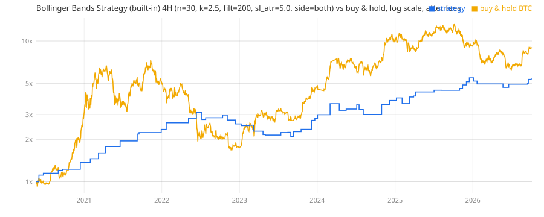

# Bollinger Bands Strategy (built-in) on 4H: full backtest

Bybit BTCUSDT perpetual, 2020-05-21 to 2026-10-05. Settings: n=30, k=2.5, filt=200, sl_atr=5.0, side=both. Signal on the close, fill at the next open, in the market all the time (reverses on the opposite signal), 1x, full equity per trade.

| Window | Profit factor | Trades / year | Win rate | Return | Max drawdown | Buy & hold |
|---|---|---|---|---|---|---|
| Train (settings picked here) | 2.88 | 9 | 72% | +253% | 32% | +552% |
| Test (never seen) | 2.93 | 10 | 74% | +55% | 15% | +38% |
| Whole period | 2.89 | 9 | 73% | +447% | 32% | +804% |

## Per calendar year

| Year | PF | Trades | Win rate | Return | Max DD | BTC |
|---|---|---|---|---|---|---|
| 2020 | 99.00 | 5 | 100% | +37% | 0% | +205% |
| 2021 | 99.00 | 7 | 100% | +71% | 0% | +58% |
| 2022 | 1.47 | 8 | 62% | +9% | 17% | -65% |
| 2023 | 1.46 | 12 | 58% | +9% | 18% | +160% |
| 2024 | 2.53 | 10 | 70% | +40% | 16% | +121% |
| 2025 | 3.09 | 11 | 73% | +32% | 9% | -7% |
| 2026 | 1.59 | 6 | 67% | +5% | 10% | -2% |

## Longs vs shorts (whole period)

| Side | Trades | PF | Win rate | Avg trade | Avg bars held |
|---|---|---|---|---|---|
| Long | 32 | 3.31 | 75% | +3.72% | 61 |
| Short | 27 | 2.44 | 70% | +2.50% | 44 |

## Fee sensitivity (whole period)

| Cost per side | PF | Return |
|---|---|---|
| 0 (no fees) | 3.03 | +496% |
| 0.02% (Bybit maker) | 2.99 | +483% |
| 0.055% (Bybit taker) | 2.93 | +460% |
| 0.075% (taker + slippage, used above) | 2.89 | +447% |
| 0.15% (bad fills) | 2.76 | +402% |

## Neighbouring settings (one parameter moved one step), test window

| Changed | Train PF | Test PF | Test return |
|---|---|---|---|
| n=20 | 1.43 | 2.16 | +44% |
| n=50 | 3.42 | 1.24 | +3% |
| k=2.0 | 2.07 | 2.25 | +62% |
| k=3.0 | 3.40 | 1.94 | +13% |
| filt=50 | 1.54 | 1.32 | +1% |
| sl_atr=3.0 | 1.83 | 3.83 | +65% |
| side=long | 4.47 | 1.31 | +5% |

## Same settings on other chart timeframes

An edge that only shows up on one candle size is likely luck.

| Chart | Train PF | Test PF | Trades / year | Test return |
|---|---|---|---|---|
| 1H | 1.06 | 0.70 | 35 | -24% |
| 2H | 1.07 | 0.92 | 16 | -9% |
| 3H | 1.16 | 1.62 | 11 | +21% |
| 4H (tested) | 2.88 | 2.93 | 9 | +55% |
| 6H | 1.51 | 1.25 | 6 | +5% |
| 8H | 1.54 | 0.95 | 5 | -4% |
| 12H | 3.13 | 1.32 | 3 | +4% |
| 24H | 1.09 | 99.00 | 2 | +38% |

