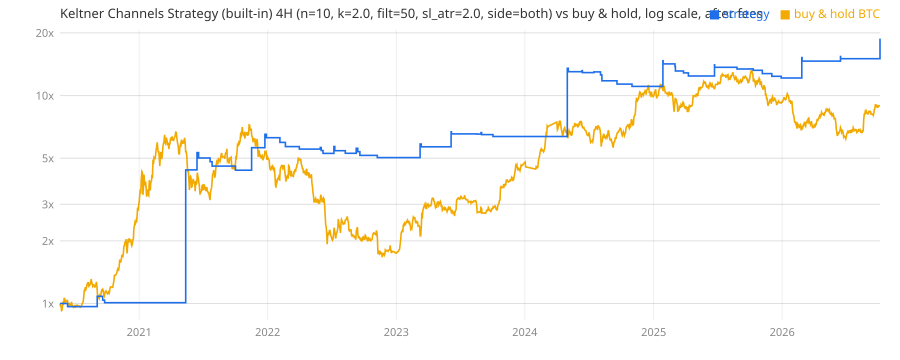

# Keltner Channels Strategy (built-in) on 4H: full backtest

Bybit BTCUSDT perpetual, 2020-05-21 to 2026-10-05. Settings: n=10, k=2.0, filt=50, sl_atr=2.0, side=both. Signal on the close, fill at the next open, in the market all the time (reverses on the opposite signal), 1x, full equity per trade.

| Window | Profit factor | Trades / year | Win rate | Return | Max drawdown | Buy & hold |
|---|---|---|---|---|---|---|
| Train (settings picked here) | 5.89 | 10 | 33% | +1036% | 23% | +552% |
| Test (never seen) | 2.54 | 10 | 30% | +65% | 17% | +38% |
| Whole period | 4.92 | 10 | 32% | +1779% | 23% | +804% |

## Per calendar year

| Year | PF | Trades | Win rate | Return | Max DD | BTC |
|---|---|---|---|---|---|---|
| 2020 | 33.68 | 5 | 40% | +339% | 7% | +205% |
| 2021 | 2.87 | 8 | 38% | +43% | 18% | +58% |
| 2022 | 0.43 | 13 | 23% | -20% | 20% | -65% |
| 2023 | 15.10 | 9 | 44% | +169% | 5% | +160% |
| 2024 | 1.62 | 9 | 33% | +9% | 18% | +121% |
| 2025 | 0.43 | 13 | 15% | -17% | 17% | -7% |
| 2026 | 8.84 | 5 | 60% | +55% | 4% | -2% |

## Longs vs shorts (whole period)

| Side | Trades | PF | Win rate | Avg trade | Avg bars held |
|---|---|---|---|---|---|
| Long | 34 | 8.05 | 29% | +15.32% | 179 |
| Short | 28 | 1.33 | 36% | +0.77% | 68 |

## Fee sensitivity (whole period)

| Cost per side | PF | Return |
|---|---|---|
| 0 (no fees) | 5.18 | +1956% |
| 0.02% (Bybit maker) | 5.11 | +1907% |
| 0.055% (Bybit taker) | 4.99 | +1824% |
| 0.075% (taker + slippage, used above) | 4.92 | +1779% |
| 0.15% (bad fills) | 4.69 | +1616% |

## Neighbouring settings (one parameter moved one step), test window

| Changed | Train PF | Test PF | Test return |
|---|---|---|---|
| n=20 | 1.82 | 1.16 | +4% |
| k=1.5 | 1.85 | 1.14 | -0% |
| k=2.5 | 11.32 | 4.13 | +18% |
| filt=0 | 5.89 | 2.54 | +65% |
| filt=200 | 7.92 | 1.79 | +28% |
| sl_atr=0 | 2.48 | 2.68 | +91% |
| sl_atr=3.0 | 4.63 | 1.73 | +36% |
| side=long | 9.95 | 3.36 | +52% |

## Same settings on other chart timeframes

An edge that only shows up on one candle size is likely luck.

| Chart | Train PF | Test PF | Trades / year | Test return |
|---|---|---|---|---|
| 1H | 2.15 | 1.44 | 45 | +47% |
| 2H | 3.22 | 1.67 | 20 | +47% |
| 3H | 4.58 | 2.65 | 16 | +89% |
| 4H (tested) | 5.89 | 2.54 | 10 | +65% |
| 6H | 5.58 | 3.06 | 7 | +84% |
| 8H | 4.73 | 2.96 | 7 | +51% |
| 12H | 8.22 | 8.28 | 2 | +59% |
| 24H | 2.52 | 1.35 | 2 | +3% |

